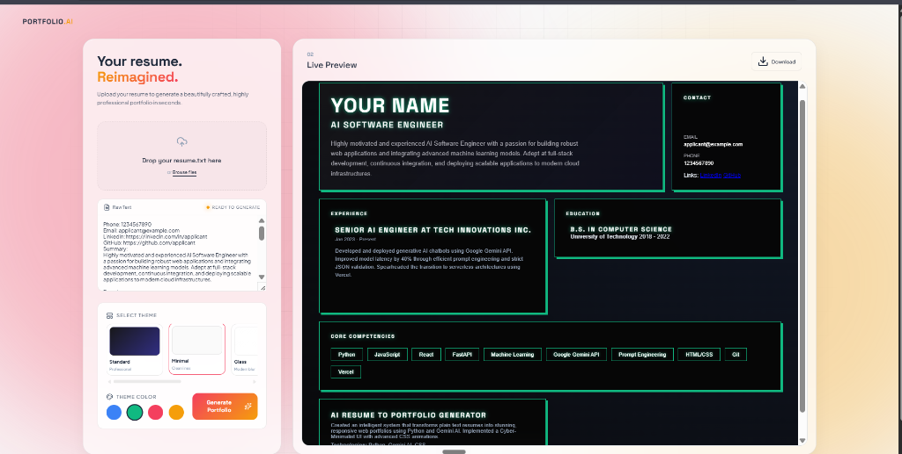

<div align="center">
  
  
  
  
  <br />
  <br />
  <h1>✨ PORTFOLIO.AI</h1>
  <p><b>Transform your unstructured resume into a sleek, premium, and portable HTML portfolio in seconds using Google Gemini AI.</b></p>
</div>

---

## 🌟 The Project
The **AI-Assisted Resume Portfolio Generator** uses the **Google Gemini API** to synthesize unstructured resume text into a fully formatted, portable HTML portfolio. Built with a clean Python/FastAPI backend and a modern web interface.

## 🚀 Key Features
- **Brighter Vibes UI**: A stunning, state-of-the-art light theme featuring staggered fade-in animations, glassmorphism panels, and premium typography (`Plus Jakarta Sans` & `Space Grotesk`).
- **Premium Theme Selection**: Choose from 5 distinct aesthetic themes (Standard, Minimal, Glassmorphism, Cyberpunk, Neobrutalism) via interactive Theme Cards, newly enhanced with dynamic ambient gradients and optimized contrast.
- **Lightning Fast AI Extraction**: Upgraded to the `gemini-1.5-flash-8b` model to accurately and instantly extract Education, Experience, Skills, and Projects from plain text, safely defaulting missing information.
- **Interactive Portfolio Chatbot**: The generated web app includes a floating AI Copilot that dynamically answers questions about your specific portfolio data.
- **Portable Export**: Instantly download a 100% self-contained `portfolio.html` with a beautiful Bento Box layout and embedded CSS.
- **Zero-Config Deployment**: Built to deploy seamlessly on serverless platforms like Vercel.
- **Smart & Relaxed Validation**: Live status indicators dynamically warn you if your input is too short. Hard constraints are relaxed with a new "Proceed Anyway" override, allowing ultimate flexibility without wasting API credits on accidents.

## 🛠 Setup & Run Instructions

### 1. Local CLI Mode (Rubric Requirement)
You can run the generator entirely locally in your terminal. It will automatically read `resume.txt` and generate `portfolio.html`.
1. Clone this repository.
2. Install dependencies: `pip install -r requirements.txt`
3. Set your API key in the terminal (Windows):
   ```bash
   set GEMINI_API_KEY=your_key_here
   ```
4. Run the script:
   ```bash
   python main.py
   ```
   *The console will output the success message, and `portfolio.html` will appear in the folder.*

### 2. Web App Mode
You can also run the stunning web app locally:
1. Copy `.env.example` to `.env` and paste your Gemini API key.
2. Start the FastAPI server:
   ```bash
   uvicorn main:app --reload
   ```
3. Open `http://localhost:8000` in your browser.

## 🧠 Prompt Architecture
Our prompt rigorously enforces a strict JSON format. It aggressively commands Gemini to **never invent data** (hallucinate). Missing fields are intelligently handled and safely suppressed in the final HTML.

## 🔄 Workflow
1. The user places their raw resume text inside `resume.txt`.
2. `main.py` is executed, which safely validates the text (enforcing a 40-word minimum).
3. The cleaned text is sent to the Gemini API with a strict structural prompt.
4. Gemini returns a fully structured JSON response mapping to the required fields.
5. `main.py` parses the JSON and dynamically maps the data into `template.html`, skipping any empty sections.
6. The final compiled HTML is saved as `portfolio.html`.

## 🧪 Testing Results
- **Missing `resume.txt`**: Throws explicit file-not-found error.
- **Short/Empty Resume**: Safely rejected by the >40 words validation check.
- **Missing API Key**: Immediately halts with configuration error message.
- **API High Demand (503)**: Handled gracefully using exponential backoff retries.
- **Missing Resume Sections**: Successfully skips creating HTML wrappers for empty fields, preventing UI bugs.

## 📸 Screenshots
*(Screenshot of the generated Cyberpunk portfolio)*


## ⚠️ Limitations
* **Hallucination Risk:** Although strongly suppressed, generative AI can sometimes hallucinate. Always review the downloaded portfolio.
* **Layout:** The current template layout is fixed, dynamically hiding sections that lack data.

---
<div align="center">
<i>Built with precision for the modern developer.</i>
</div>
